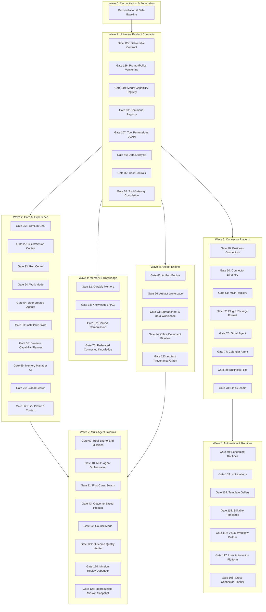

# AIRA AI — Capability Dependency Graph & Wave Sequencing

```mermaid
graph TD
  subgraph Wave0[Wave 0: Reconciliation & Foundation]
    W0[Reconciliation & Safe Baseline]
  end
  subgraph Wave1[Wave 1: Universal Product Contracts]
    G122[Gate 122: Deliverable Contract]
    G126[Gate 126: Prompt/Policy Versioning]
    G119[Gate 119: Model Capability Registry]
    G63[Gate 63: Command Registry]
    G107[Gate 107: Tool Permissions UI/API]
    G40[Gate 40: Data Lifecycle]
    G32[Gate 32: Cost Controls]
    G18[Gate 18: Tool Gateway Completion]
  end
  subgraph Wave2[Wave 2: Core AI Experience]
    G25[Gate 25: Premium Chat]
    G22[Gate 22: Build/Mission Control]
    G23[Gate 23: Run Center]
    G64[Gate 64: Work Mode]
    G54[Gate 54: User-created Agents]
    G53[Gate 53: Installable Skills]
    G55[Gate 55: Dynamic Capability Planner]
    G59[Gate 59: Memory Manager UI]
    G26[Gate 26: Global Search]
    G56[Gate 56: User Profile & Context]
  end
  subgraph Wave3[Wave 3: Artifact Engine]
    G65[Gate 65: Artifact Engine]
    G66[Gate 66: Artifact Workspace]
    G73[Gate 73: Spreadsheet & Data Workspace]
    G74[Gate 74: Office Document Pipeline]
    G123[Gate 123: Artifact Provenance Graph]
  end
  subgraph Wave4[Wave 4: Memory & Knowledge]
    G12[Gate 12: Durable Memory]
    G13[Gate 13: Knowledge / RAG]
    G57[Gate 57: Context Compression]
    G75[Gate 75: Federated Connected Knowledge]
  end
  subgraph Wave5[Wave 5: Connector Platform]
    G20[Gate 20: Business Connectors]
    G50[Gate 50: Connector Directory]
    G51[Gate 51: MCP Registry]
    G52[Gate 52: Plugin Package Format]
    G76[Gate 76: Gmail Agent]
    G77[Gate 77: Calendar Agent]
    G80[Gate 80: Business Files]
    G78[Gate 78: Slack/Teams]
  end
  subgraph Wave6[Wave 6: Automation & Routines]
    G49[Gate 49: Scheduled Routines]
    G109[Gate 109: Notifications]
    G114[Gate 114: Template Gallery]
    G115[Gate 115: Editable Templates]
    G116[Gate 116: Visual Workflow Builder]
    G117[Gate 117: User Automation Platform]
    G108[Gate 108: Cross-Connector Planner]
  end
  subgraph Wave7[Wave 7: Multi-Agent Swarms]
    G7[Gate 07: Real End-to-End Missions]
    G10[Gate 10: Multi-Agent Orchestration]
    G11[Gate 11: First-Class Swarm]
    G43[Gate 43: Outcome-Based Product]
    G62[Gate 62: Council Mode]
    G121[Gate 121: Outcome Quality Verifier]
    G124[Gate 124: Mission Replay/Debugger]
    G125[Gate 125: Reproducible Mission Snapshot]
  end
  W0 --> Wave1
  Wave1 --> Wave2
  Wave1 --> Wave3
  Wave1 --> Wave4
  Wave1 --> Wave5
  Wave5 --> Wave6
  Wave2 --> Wave7
  Wave3 --> Wave7
```
